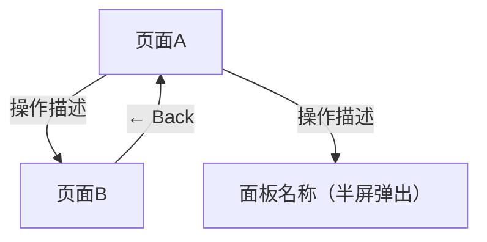

# [产品/功能名称]

> **版本**: v0.1  
> **日期**: YYYY-MM-DD  
> **状态**: 草稿  
> **编制**: [负责人]

| 版本 | 日期 | 变更说明 |
|------|------|----------|
| v0.1 | YYYY-MM-DD | 新建文档。 |

---

## 第一章 背景与问题

> **核心判断**
>
> [先给本章一句总判断：我们面对的核心问题是什么]

### 1.1 现状分析

当前产品/业务处于什么阶段，关键指标和基线是什么。

### 1.2 问题定义

本次要解决的核心问题是什么，为什么现在要解决。

### 1.3 证据支撑

支撑问题判断的关键证据，包括数据、用户反馈、竞品参考等。

---

## 第二章 目标用户与场景

> **核心判断**
>
> [先给本章一句总判断：我们为谁、在什么场景下解决问题]

### 2.1 目标用户画像

主要服务的用户画像及其核心特征。

### 2.2 核心使用场景

用户在什么情境下、带着什么目的使用本产品/功能。

### 2.3 用户旅程与痛点

用户当前的体验路径、关键痛点和体验断点。

---

## 第三章 产品定义与方案

> **核心判断**
>
> [先给本章一句总判断：我们用什么方案解决、核心策略是什么]

### 3.1 产品定位

一句话定义产品/功能是什么、不是什么。

### 3.2 方案概述

选定的方案方向及核心策略。

### 3.3 核心假设

方案成立的前提假设，以及验证状态。

### 3.4 角色与关系

如涉及多角色/多端，定义角色关系和交互边界。

---

## 第四章 范围与边界

> **核心判断**
>
> [先给本章一句总判断：这个版本做什么、不做什么]

### 4.1 V1 范围

本版本明确纳入的功能和能力。

### 4.2 明确不做

本版本明确排除的内容，以及排除理由。

### 4.3 条件性纳入

满足特定条件才纳入的功能。

### 4.4 成功标准

上线后如何判断是否成功，核心验收指标。

---

## 第五章 功能定义

> **核心判断**
>
> [先给本章一句总判断：核心功能模块是什么、关系是什么]

### 5.1 功能架构

#### 5.1.1 模块总览

用一张表概括所有功能模块的全局视图。模块划分方法详见 `references/methodology/feature-module-design.md`。

```
| 模块 | 功能数 | 核心功能 |
|------|-------|---------|
| A: [模块名] | N | [核心功能列表] |
| B: [模块名] | N | [核心功能列表] |
| ... | ... | ... |
```

#### 5.1.2 页面导航架构图

用 Mermaid 画出所有页面和弹层之间的跳转关系，让所有读者在 30 秒内看清产品的页面层级和导航结构。



#### 5.1.3 模块间关系

跨模块功能的归属决策和数据流向。

### 5.2 功能需求详情

按功能模块逐个拆分，每个模块占据表格中的一行。**这是 PRD 最核心的章节，必须严格遵循以下模板，不得简化、不得用段落式描述替代。**

#### 5.2.1 固定表格格式（不可更改）

```
| 模块 | 需求描述 | 原型图 |
|------|---------|--------|
| F-XX 模块名称 | （见下方结构模板） | 待设计 /  |
```

#### 5.2.2 「原型图」列规则

原型图列的状态流转严格遵循以下顺序：

1. **PRD 初稿阶段**：填写 `待设计`
2. **原型设计完成后**：在 Figma / 设计工具中完成原型 → 导出 PNG → 存入 `images/` 目录 → 替换为 ``
3. **多状态页面**：同一模块有多个状态（如空状态、错误状态、加载状态），每个状态单独一张 PNG，编号后缀：`F-A01-feed-empty.png`、`F-A01-feed-loading.png`

禁止原型图列长期留空或填写"无"。PRD 评审前，所有 Must-have 模块的原型图列必须已替换为 PNG 引用。

#### 5.2.3 「需求描述」列结构模板（强制）

每个模块的需求描述必须包含以下编号段落，使用 `<br>` 换行 + 全角空格 `　` 缩进。**缺少任何一个段落视为粒度不合格，必须补全。**

```
**1. 入口**<br>
　从哪里进入本功能，触发条件是什么<br><br>

**2. 页面组成（从上到下）**<br>
　2.1 组件名称A<br>
　　- 内容：展示什么<br>
　　- 数据来源：后端接口 / 本地缓存 / 第三方 SDK<br>
　　- 默认值：首次加载时展示什么<br>
　　- 条件变化：什么条件下内容/状态改变<br>
　　　· 条件 A → 行为 A<br>
　　　· 条件 B → 行为 B<br>
　2.2 组件名称B<br>
　　...（同上结构，逐个列出）<br><br>

**3.【交互元素名称 A】**<br>
　3.1 元素形态：按钮 / 输入框 / 开关 / 列表项 / 手势<br>
　3.2 触发动作：点击 / 长按 / 滑动 / 输入<br>
　3.3 执行流程<br>
　　3.3.1 发起请求 → 调用什么接口 / 触发什么本地操作<br>
　　3.3.2 成功 → 下一步处理<br>
　　　a. 分支条件 A → 行为 A<br>
　　　b. 分支条件 B → 行为 B<br>
　　3.3.3 失败 → 具体错误提示文案（英文）+ 重试逻辑（自动/手动/倒计时）<br>
　　3.3.4 取消 → 返回行为<br>
　3.4 条件激活<br>
　　- 何时可点（激活条件）<br>
　　- 何时灰化 / 隐藏（禁用条件）<br>
　　- 冷却时间（如有）<br><br>

**4.【交互元素名称 B】**<br>
　...（同上结构，每个可交互元素独立编号）<br><br>

**N. 数据加载与刷新**<br>
　N.1 首次加载：加载数量、排序规则、预期耗时上限<br>
　N.2 分页/无限滚动：触发条件、每页数量、加载中状态<br>
　N.3 下拉刷新：刷新范围、刷新后行为<br>
　N.4 返回保持：从子页面返回时保持滚动位置，不重新加载<br><br>

**N+1. 空状态与异常**<br>
　(N+1).1 空状态<br>
　　a. 场景 A 无数据 → 插画 + 文案 + 引导按钮（写明按钮文案和点击行为）<br>
　　b. 场景 B 无数据 → 插画 + 文案（写明差异化处理）<br>
　(N+1).2 网络异常<br>
　　- 离线 → 顶部横幅提示文案 + 展示已缓存内容<br>
　　- 弱网 → 加载超时处理 + 重试机制<br>
　(N+1).3 权限异常（如适用）<br>
　　- 未登录 → 跳转登录页 / 展示引导<br>
　　- 无权限 → 提示文案 + 替代操作
```

#### 5.2.4 完整页面级标杆示例

以下示例展示一个完整功能模块应达到的粒度标准。**写 PRD 时必须对照此示例检查每个模块的完整度。**

| 模块 | 需求描述 | 原型图 |
|------|---------|--------|
| F-A01 Feed 基础架构 | **1. 入口**<br>　App 首页，默认进入 Feed<br><br>**2. 页面组成（从上到下）**<br>　2.1 顶部导航栏：左侧显示当前城市名称，起城市筛选作用，下方 Feed 仅展示该城市下的帖子<br>　　2.1.1 默认显示"全国"（展示所有城市帖子）<br>　　2.1.2 非中国境内 → 显示"全国"<br>　　2.1.3 中国境内 → GPS 定位到具体城市：<br>　　　· 该城市在列表中（有帖子）→ 自动选中该城市，Feed 展示该城市帖子<br>　　　· 该城市不在列表中（无帖子）→ 保持"全国"<br>　　2.1.4 点击城市名称 → 打开城市选择面板（详见 F-A05），切换后 Feed 刷新为对应城市内容<br>　2.2 分类标签栏：水平可滚动的分类标签，在当前城市范围内做二级筛选<br>　　- 类型：全部、标签A、标签B...（运营配置，名称和排序由后台管理）<br>　　- 点击 Tab → 在当前城市下按分类筛选，内容区展示对应分类的帖子<br>　　- 筛选层级：城市（一级）→ 分类（二级），两者叠加生效<br>　2.3 帖子卡片列表：双列瀑布流布局（参考小红书），左右两列交错排列<br>　　- 首屏加载 20 条（10 行 × 2 列），后续每次滚动加载 20 条<br>　　- 性能要求：首屏从打开 App 到首条帖子可见 < 1.5 秒<br>　2.4 底部导航栏：固定在屏幕底部<br><br>**3. 无限滚动加载**<br>　3.1 滚动到距离底部约 3 行卡片高度时 → 自动预加载下一页（每页 20 条）<br>　3.2 加载中 → 底部显示旋转指示器<br>　3.3 加载结果：<br>　　- 成功 → 新帖子追加到底部<br>　　- 失败 → 显示 `Failed to load more. Tap to retry.`，点击重试<br>　　- 无更多内容 → 进入"刷完"状态（见下方 3.4）<br>　3.4 刷完所有内容后：<br>　　a. 底部显示 `You're all caught up!`，停止触发加载<br>　　b. 如果当前是具体城市 → 下方追加推荐区：`Explore other cities` + 展示 3 个热门城市卡片，点击 → 切换到该城市 Feed<br>　　c. 如果当前是"全国" → 下方显示 `Come back later for more!`，不再加载<br>　　d. 用户下拉刷新 → 可获取刷完后新发布的帖子<br>　3.5 从详情页返回 → 保持之前的滚动位置，不重新加载<br><br>**4. 空状态与异常**<br>　4.1 当前城市无帖子：<br>　　a. 选中具体城市（如 Shanghai）→ 插画 + `No posts yet in Shanghai.` + `Switch City` 按钮<br>　　　· Switch City 点击 → 打开城市选择面板（同 F-A05），用户可切换到其他城市<br>　　b. 选中"全国"但全站无帖子 → 插画 + `We're just getting started! Check back soon.`（不显示 Switch City 按钮，因为已是最大范围）<br>　　c. 文案中的城市名 = 用户当前选中的城市英文名，直接替换显示<br>　4.2 离线 → 顶部 No connection 横幅 + 展示已缓存收藏内容 | 待设计 |

#### 5.2.5 粒度自检清单（每个模块必须通过）

写完一个模块后，逐项检查：

- [ ] 入口段落是否写明了从哪里进入、什么条件触发
- [ ] 页面组成是否从上到下逐个列出了所有可见元素
- [ ] 每个可见元素是否标注了数据来源（后端/缓存/SDK/本地）
- [ ] 每个可交互元素（按钮/输入框/开关/列表项/手势）是否单独编号
- [ ] 每个交互是否写到了「触发 → 执行 → 成功/失败/取消」三个分支
- [ ] 成功分支是否覆盖了所有条件分叉（如"新用户 vs 老用户"）
- [ ] 失败分支是否写了具体错误提示文案（英文），不是"显示错误"
- [ ] 条件激活是否写明了何时可点、何时灰化
- [ ] 数据加载是否写了首次加载量、分页规则、刷新行为、返回保持
- [ ] 空状态是否写了插画 + 文案 + 引导操作（按钮文案和点击行为）
- [ ] 离线/弱网是否写了降级策略
- [ ] 性能要求是否有量化指标（如加载时间上限）

**不满足 8 项以上的模块，视为粒度不合格，必须补全后才能进入下一个模块。**

#### 5.2.6 禁止写入

- 色值（如 `#007AFF`）、字号（如 `14px`）、圆角（如 `12px`）、间距像素等设计规格
- 这些属于设计稿的职责，不是 PRD 的内容
- 可以写的功能性样式描述：「系统标准黑色圆角按钮」「红色文字按钮」「灰色不可点」——传达功能状态而非设计规格

### 5.3 功能优先级

功能优先级排序及依赖关系。

---

## 第六章 流程与交互

> **核心判断**
>
> [先给本章一句总判断：核心用户流程是什么]

### 6.1 主链路流程

核心用户操作路径，从入口到完成的完整流程。

### 6.2 异常与边界

异常场景处理、边界条件和降级方案。

---

## 第七章 依赖与风险

> **核心判断**
>
> [先给本章一句总判断：关键风险和依赖是什么]

### 7.1 上下游依赖

技术依赖、数据依赖、业务依赖。

### 7.2 风险识别

已知风险、影响程度、应对策略。

### 7.3 后续规划

下一版本的方向和待解决的遗留问题。
