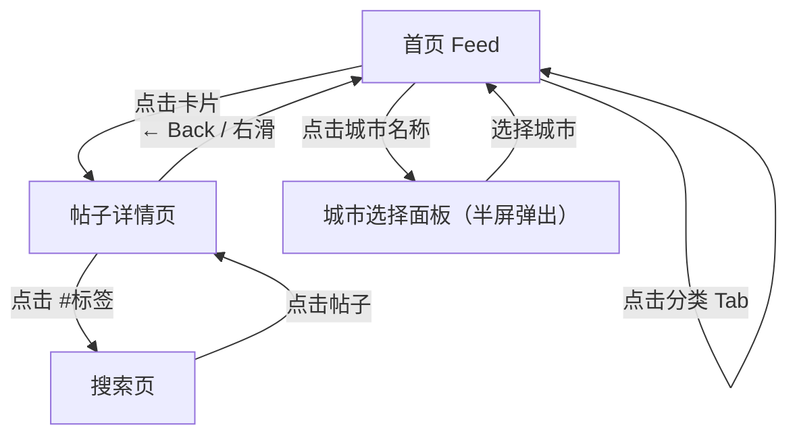

# 功能模块划分与架构设计规范

> 本文档定义 PRD 第五章「功能定义」中模块如何划分、页面导航架构图如何绘制、跨模块功能如何归属。
> 与 `feature-requirement-writing` 侧重"每个模块怎么写"不同，本文档解决"模块怎么切、全局怎么看"的问题。

---

## 一、模块划分方法

### 1.1 什么是「模块」

模块是 PRD 功能定义章节的最大组织单元。一个模块包含一组职责相近、服务于同一用户目的的功能点。模块划分的目标是让开发、设计和测试能按模块独立领取工作。

### 1.2 划分优先级

按以下三级优先级逐层尝试，直到找到自然的切分边界：

| 优先级 | 划分维度 | 适用条件 | 举例 |
|--------|---------|---------|------|
| 1 | **按页面/场景** | 产品有明确的页面层级（列表页、详情页、设置页等） | Feed 信息流、帖子详情页、城市选择面板 |
| 2 | **按用户行为阶段** | 用户旅程阶段清晰，但一个页面承载多个阶段 | 浏览模块、创作模块、互动模块 |
| 3 | **按功能域** | 功能跨多个页面存在，属于通用能力 | 翻译模块、通知模块、支付模块 |

**实操建议**：大多数面向 C 端的产品，优先按页面/场景划分最直觉。只有当一个功能确实跨越多个页面且逻辑独立时（如"点赞"在卡片和详情页都出现），才提取为独立的功能域模块。

### 1.3 划分后的自检

每个模块划分完成后，用以下三个标准自检：

| 标准 | 检验问题 | 不通过的信号 |
|------|---------|------------|
| **独立性** | 砍掉这个模块，其他模块是否还能正常运行？ | 砍掉后多个模块同时不可用 → 说明拆太细了，应该合并 |
| **内聚性** | 模块内的功能点是否都在解决同一类问题？ | 模块内有功能点和其他功能点毫无关系 → 应该移走 |
| **边界清晰** | 两个模块之间有没有功能点归属模糊？ | 一个功能点放两个模块都说得通 → 需要用归属规则（见第三节）明确 |

### 1.4 模块编号规则

- 每个模块用大写字母编号：Module A、Module B...
- 模块下的每个功能点用 `F-A01`、`F-A02` 格式编号（F = Feature，A = 模块字母，01 = 序号）
- 编号一旦分配不得复用——删除的功能点编号保留空缺，避免后续引用混乱
- 功能优先级表、用户故事、PRD 功能详情三份文档必须引用同一套 F-XX 编号

---

## 二、页面导航架构图

### 2.1 为什么必须画

PRD 第五章在逐模块展开功能详情之前，必须先有一张**页面导航架构图**。它的作用是让所有读者（开发、设计、测试、产品负责人）在 30 秒内看清：
- 一共有几个页面/弹层
- 页面之间通过什么操作跳转
- 哪些是独立页面，哪些是弹层/半屏

没有这张图，每个模块的"入口"描述就是孤立的，读者无法形成全局认知。

### 2.2 绘制规范

使用 Mermaid `graph TD`（从上到下）或 `graph LR`（从左到右），遵循以下规则：

| 元素 | 规范 |
|------|------|
| 页面节点 | 用 `["页面名"]` 方括号表示 |
| 弹层/半屏 | 在节点名中标注 `（半屏弹出）` 或 `（弹窗）` |
| 跳转操作 | 用 `--\|操作描述\|` 标注在箭头上 |
| 返回操作 | 用 `--\|← Back / 右滑\|` 标注 |
| 原地触发 | 用 `-->` 指向自身或标注 `（原地触发）` |

### 2.3 示例



### 2.4 在 PRD 中的位置

页面导航架构图放在第五章 `§5.1 页面导航架构`，在功能需求详情（§5.2）之前。

---

## 三、跨模块功能归属

### 3.1 问题场景

当一个功能涉及多个页面时（如"点赞"在卡片上展示状态、在详情页承载交互），需要明确它归属到哪个模块。

### 3.2 归属规则

| 规则 | 说明 | 举例 |
|------|------|------|
| **交互逻辑归主模块** | 功能归属到承载主要交互逻辑的模块 | "双击点赞"的交互逻辑在详情页 → 归属互动模块或详情页模块 |
| **展示引用不重复** | 其他模块需要展示该功能结果时，用 F-XX 编号交叉引用 | 卡片上展示点赞数 → 在卡片模块中写"点赞状态详见 F-D01" |
| **共享逻辑提公共** | 如果多个页面的交互逻辑完全相同（不只是展示），提取为独立的功能域模块 | "收藏"在详情页和搜索结果页交互逻辑完全一致 → 提取为互动模块 |

### 3.3 交叉引用格式

在需求描述中引用其他模块的功能时，使用以下格式：

```
详见 F-D01（点赞功能）
```

禁止在两个模块中重复描述同一段交互逻辑——这会导致修改时漏改一处，产生文档内部矛盾。

---

## 四、模块总览表

在每个模块的功能详情之前，先用一张模块总览表概括全局：

```markdown
| 模块 | 功能数 | 核心功能 |
|------|-------|---------|
| A: Feed 信息流 | 7 | 列表滚动 + 排序 + 骨架屏 + 城市切换 + 分类筛选 + 懒加载 |
| B: 帖子卡片 | 5 | 标准卡片 + 封面图 + 标题 + 标签浮层 + 头像昵称 |
| C: 帖子详情页 | 2 | 完整布局 + Hashtag 跳转搜索 |
| D: 互动功能 | 3 | 点赞 + 收藏 + 分享 |
```

这张表让读者在进入逐模块详情之前，先建立全局认知。

---

## 五、写完后的一致性反查

### 5.1 PRD 内部一致性

第五章全部模块写完后，必须反查以下文档：

| 检查对象 | 检查内容 | 常见问题 |
|---------|---------|---------|
| 用户故事 | 验收标准与功能需求描述是否矛盾 | 用户故事写了"展示多图角标"，PRD 决定不展示 |
| 功能优先级 | 功能描述与 PRD 中的描述是否一致 | 优先级表写"卡片显示点赞数"，PRD 改为不显示 |
| 第六章流程图 | 是否覆盖了第五章所有可跳转的功能路径 | 第五章新增了"Hashtag 跳转搜索"，第六章流程图没画 |

### 5.2 跨文档术语统一

同一个功能/概念在所有文档中必须使用同一个术语：

- 如果 PRD 叫"城市选择面板"，用户故事里不能叫"城市切换弹窗"
- 如果 PRD 用 F-A05 编号，功能优先级和用户故事也必须引用同一个编号

### 5.3 一致性检查时机

- **首次**：第五章所有模块写完后，在进入第六章之前
- **每次修改**：PRD 中任何功能模块发生变更后，同步更新用户故事和功能优先级中的对应描述
