# 豆包爱学竞品分析
> **Agent**: 调研  
> **日期**: 2026-03-10  
> **版本**: v3.0  
> **调研方式**: `应用商店 979条评论`、`小红书260帖`、`微博18条验证记录`、`B站30条视频`、`知乎13条样本`、`SEO 46 个搜索结果页`、`Web 30 条证据`、`两轮真实体验素材`  
> **本轮重点**: `产品现状、AI讲题链路、错题本复盘、商业化阶段、竞争判断`

---

## 1. 总结

### 1.1 四个最终判断

1. 从当前产品形态、用户反馈和真实体验看，豆包爱学可归类为 `老师化的 AI 学习助手`。其竞争力主要来自 `免费 + 像老师 + 进入快` 的组合，而非题库规模或课程体系。
2. 产品差异主要不在拍题入口，而在于将 `AI讲题` 与 `AI错题本` 组织为一条可继续复盘的学习链路。
3. 主要脆弱点在于正确率稳定性。图形题、复杂题和学段错配会直接削弱“像老师”的信任感。
4. `独立品牌、搜索承接、可见收费` 三层尚未形成稳态，因此其优势主要集中在 App 内体验，公开解释权和商业结构仍偏弱。

### 1.2 最值得学 / 最该避

| 类型 | 当前判断 | 为什么 |
|---|---|---|
| 最值得学 | `拍题/作业 -> 分步讲题 -> 追问 -> 继续讲` 的老师时刻闭环 | 首个价值时刻被压缩得足够短，用户几乎在第一次使用时就能感知到“被带着讲” |
| 第二个值得学 | `错题本 -> 继续讲题 / 写笔记 / 打印` 的复盘资产层 | 一次性求助被转化为后续可利用的学习资产，产品角色由工具延伸为长期陪学入口 |
| 最该避 | 在高“老师感”预期下容忍不稳定正确率 | 一旦讲解出错，口碑伤害会高于普通问答工具 |
| 需要谨慎复制 | 用家长认证替代完整家长协同 | 这类设计可以处理治理问题，但并不等于建立了完整的家长协同或稳定付费结构 |

### 1.3 对我方一句建议

如果我方继续以“更会答题的工具”为核心定位，将直接进入豆包爱学已经教育过的用户预期。更可行的方向，是围绕 `老师时刻 + 复盘资产 + 正确率透明度` 建立组合优势。

---

## 2. 分析建模

本节主证据：[1](../03-platforms/appstore/summary.md) [2](../03-platforms/xiaohongshu/summary.md) [3](../04-experience/EXPERIENCE_REPORT.md) [4](../03-platforms/seo/summary.md) [5](../03-platforms/pricing/summary.md)

### 2.1 核心问题

本章用于界定分析框架、判断口径与证据边界。基于应用商店、小红书、真实体验和 SEO 证据，本文将分析框架划分为 `入口 -> 首次价值 -> 讲题体验 -> 复盘资产 -> 边界与商业` 五层。

据此，本文聚焦以下三个判断问题：

1. 豆包爱学的用户价值主要由哪些能力建立，而非单纯依赖哪些获客入口。
2. 它已经形成了哪些难被忽视的用户预期，尤其是“老师感”和“复盘资产”。
3. 它当前还没站稳哪些层，这些空位对我方意味着什么。

### 2.2 分析模块与判断口径

| 分析模块 | 为什么必须看 | 本轮核心判断 | 主证据 |
|---|---|---|---|
| 入口层 | 决定用户为什么第一次点开它 | 公开承接主要来自 `应用商店`、独立 App、豆包主 App 内入口和短内容平台，不靠官网 | [1](../03-platforms/appstore/summary.md) [4](../03-platforms/seo/summary.md) |
| 首次价值层 | 决定用户为什么愿意留下来 | 首个价值时刻体现为“题目被带着讲下去”，而非静态答案输出 | [1](../03-platforms/appstore/summary.md) [3](../04-experience/EXPERIENCE_REPORT.md) |
| 讲题体验层 | 决定产品为什么像老师 | `分步骤讲`、`可打断`、`能继续解释` 才是老师感来源 | [1](../03-platforms/appstore/summary.md) [3](../04-experience/EXPERIENCE_REPORT.md) |
| 复盘资产层 | 决定产品是否只是一次性工具 | `AI错题本` 相较 `学习记录` 更接近长期复盘资产 | [2](../03-platforms/xiaohongshu/summary.md) [3](../04-experience/EXPERIENCE_REPORT.md) |
| 边界与商业层 | 决定产品如何治理风险和未来如何收费 | 当前用户可见边界主要体现为 `家长认证`，收费结构仍不明显 | [3](../04-experience/EXPERIENCE_REPORT.md) [5](../03-platforms/pricing/summary.md) |

本轮建模形成两项核心判断：

1. 其交互形态更接近任务导向的学习助手，而非通用聊天框的教育化包装。
2. 差异不在功能数量，而在于 `讲题` 与 `复盘` 被组织为持续使用链路。

  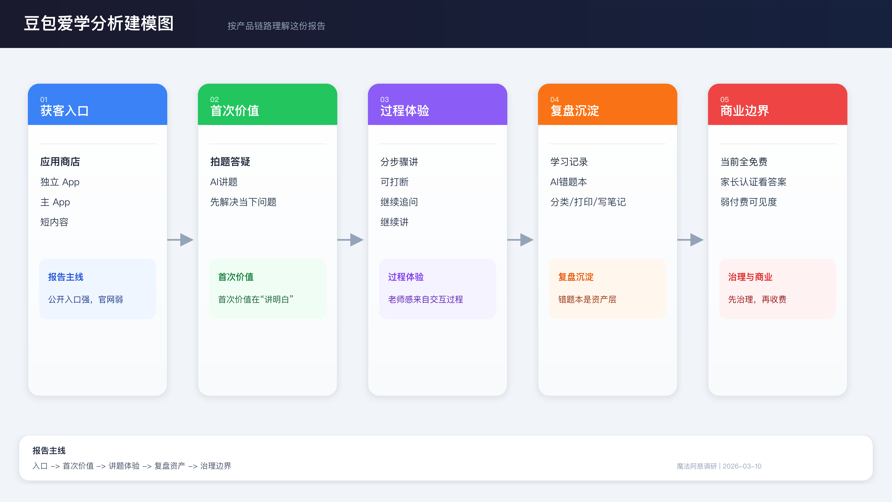

### 2.3 证据边界与未决问题

| 证据边界 | 当前状态 | 对正文判断的影响 |
|---|---|---|
| `学力提升计划 / 会员` | 历史上有弱线索，但本轮实测未验证 | 不能把豆包爱学写成“已建立会员体系” |
| 错题本深层流程 | 已看到入口与关键动作，但缺完整截图链路 | 能确认它是资产层，暂不能把闭环细节写得过满 |
| 题型级准确率 | 仍以用户反馈和评论为主，未做系统化实测 | 可以写“高频风险”，不能写成精确能力结论 |
| 渠道覆盖 | 当前主要基于 iOS、Web 和公开平台证据 | 这份报告描述的是用户可见层，不代表全渠道最终状态 |

---

## 3. 产品分析

本节主证据：[1](../04-experience/EXPERIENCE_REPORT.md) [2](../03-platforms/appstore/summary.md) [3](../03-platforms/xiaohongshu/summary.md)

本章从产品结构、关键价值路径、复盘资产与主要摩擦四个维度展开。

### 3.1 两个端口的入口与首页承接

先看端口，再看功能结构。对豆包爱学来说，用户从哪里进入、进入后先看到什么，本身就是产品形态判断的一部分。

<table>
  <tr>
    <th align="left" width="14%">端口</th>
    <th align="center" width="22%">入口图片</th>
    <th align="center" width="22%">首页图片</th>
    <th align="left" width="42%">洞察</th>
  </tr>
  <tr>
    <td valign="top"><strong>独立 App</strong> 应用商店独立承接</td>
    <td align="center" valign="top">
       
      图 3-1 应用商店入口：独立承接“作业批改 / AI答疑”
    </td>
    <td align="center" valign="top">
      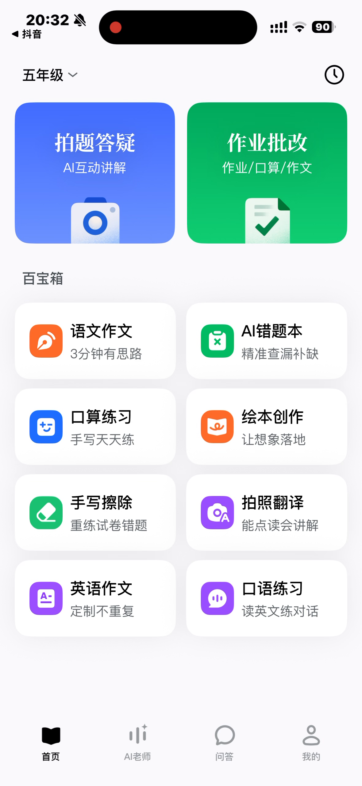 
      图 3-2 独立 App 首页：首屏直接给出拍题答疑与作业批改
    </td>
    <td valign="top">独立 App 的入口和首页都是任务导向。用户在进入前已经知道自己会得到什么，进入后也不需要先经过内容广场，而是直接落到“解决题目问题”的主任务面板。</td>
  </tr>
  <tr>
    <td valign="top"><strong>豆包主 App</strong> 通用豆包内的爱学入口</td>
    <td align="center" valign="top">
      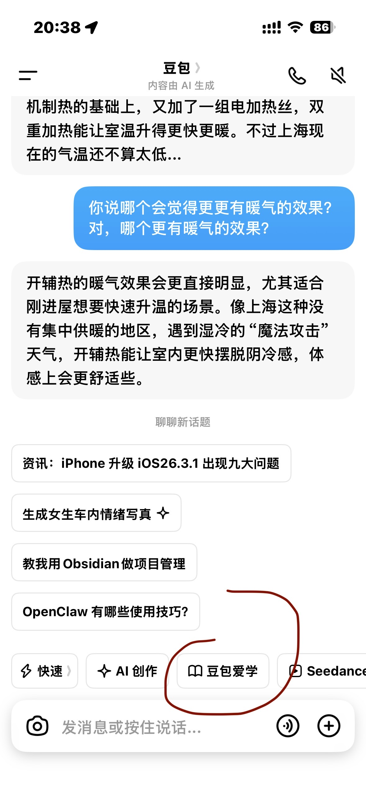 
      图 3-3 主 App 入口：爱学作为通用豆包里的一个标签进入
    </td>
    <td align="center" valign="top">
      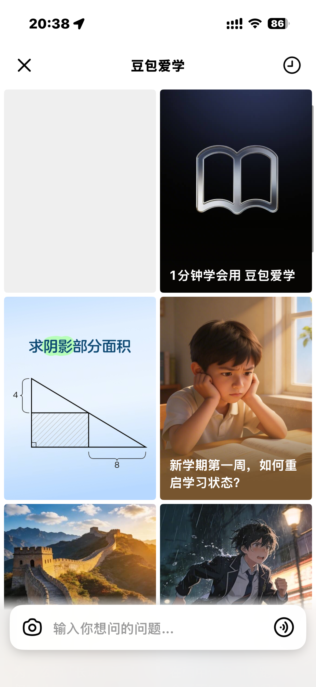 
      图 3-4 主 App 首页：先承接内容广场，再进入具体讲题
    </td>
    <td valign="top">豆包主 App 的入口更弱，首页也不是直接给任务，而是先把爱学组织成一个内容与能力频道。它更像豆包生态内的教育分区，而不是一个一打开就开始解题的独立产品。</td>
  </tr>
</table>

#### 单独需要拎出的重点

- `入口差异`：独立 App 从应用商店单独承接，用户在进入前就被明确告知这是教育产品；豆包主 App 则依赖通用豆包里的次级入口。
- `首页差异`：独立 App 首页直接给出 `拍题答疑 / 作业批改` 这类主任务；豆包主 App 首页先展示爱学内容和题目卡片，用户还要再做一次选择。
- `治理差异`：独立 App 首次进入还会显式经过协议确认与青少年守护提示，说明它被当成独立教育产品管理；主 App 里的治理感相对更弱。
- `结构结论`：两个端口最终汇聚到同一套讲题与复盘能力，但入口强度和首页承接逻辑并不一样，这直接影响用户对豆包爱学的第一印象。

#### 两个端口汇聚后的共用结构

  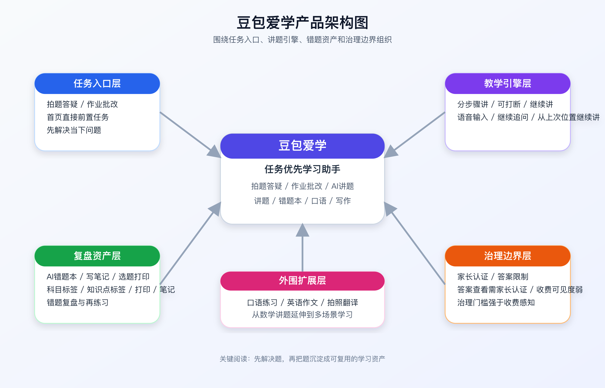

上表解决的是“从哪里进、进来先看到什么”；这张结构图补的是“两个端口最终会汇到哪一套共同能力”。

| 一级结构 | 核心模块 | 产品角色 | 本轮判断 |
|---|---|---|---|
| 任务入口层 | `拍题答疑`、`作业批改` | 把用户从“卡住的题”直接带进来 | 先解决当下问题，再解释产品能力 |
| 教学引擎层 | `AI讲题 / AI老师` | 负责建立老师感 | 构成产品的核心价值时刻 |
| 复盘资产层 | `AI错题本`、`写笔记`、`选题打印` | 负责把一次性问答变成可复用的学习资产 | 这是豆包爱学较易被低估的能力层 |
| 治理边界层 | `家长认证`、`答案查看限制` | 负责合规和风险管理 | 主要体现为治理门槛，收费属性不强 |
| 外围扩展层 | `口语练习`、`英语作文`、`拍照翻译` | 把频次从数学讲题拉向多场景学习 | 有扩张能力，但仍需更多体验证据 |

#### 核心功能矩阵

| 功能 | 公开证据 | 体验证据 | 用户为什么在意 |
|---|---|---|---|
| 拍题答疑 | 首页首屏、应用商店描述 | 可直接进入讲题链路 | 是最快建立价值感知的入口 |
| AI讲题 | 979 条评论里的正向评价、小红书口语与讲题内容 | `分步骤讲`、`可打断`、`继续讲` | 构成“像老师”体验的核心来源 |
| 作业批改 | 首页入口、官方口径、家长分享帖 | 承接家长减负需求 | 强化家长侧推荐与传播 |
| AI错题本 | 小红书错题本主题 17 条 | `分类 / 打印 / 1对1讲题 / 写笔记` | 使产品从一次性问答工具转向复盘工具 |
| 口语练习 | 小红书口语主题 24 条 | 首页已铺出英语相关入口 | 表明产品并不局限于作业工具 |

### 3.2 首次价值时刻与关键路径

#### 重点功能路径

| 路径 | 关键页面 / 交互 | 产品含义 |
|---|---|---|
| 首页 → 拍题答疑 → AI讲题 | 首屏最大入口 + 讲题页面 | 决定首次价值时刻是否成立 |
| AI讲题 → 中途追问 → 继续讲 | 语音输入、继续讲 | 决定老师感是否真实 |
| 学习记录 → 查看答案 → 家长认证 | 解析可见、答案需认证 | 体现答案层治理逻辑 |
| 错题本 → 单题详情 → 写笔记 / 1对1讲题 / 打印 | 单题的再次利用 | 决定产品有没有复盘资产层 |

  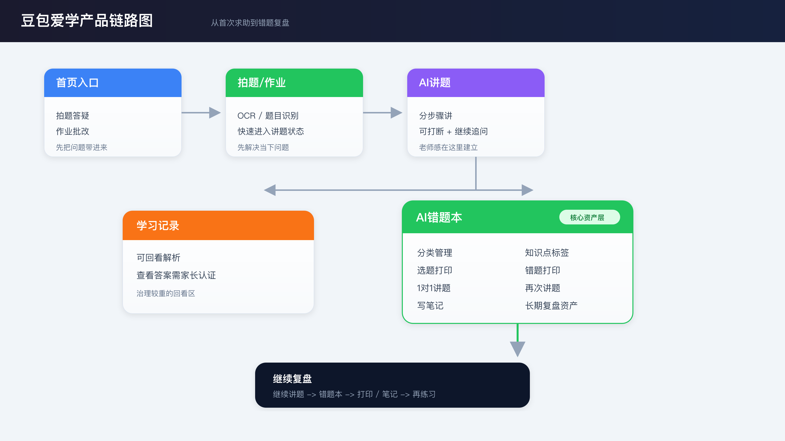

#### 真实路径图板

路径 A 对应“首次价值时刻”，展示从首页入口进入讲题，再到继续讲的真实链路。

<table>
  <tr>
    <td align="center" width="23%">
      
    </td>
    <td align="center" width="4%"><strong>→</strong></td>
    <td align="center" width="23%">
      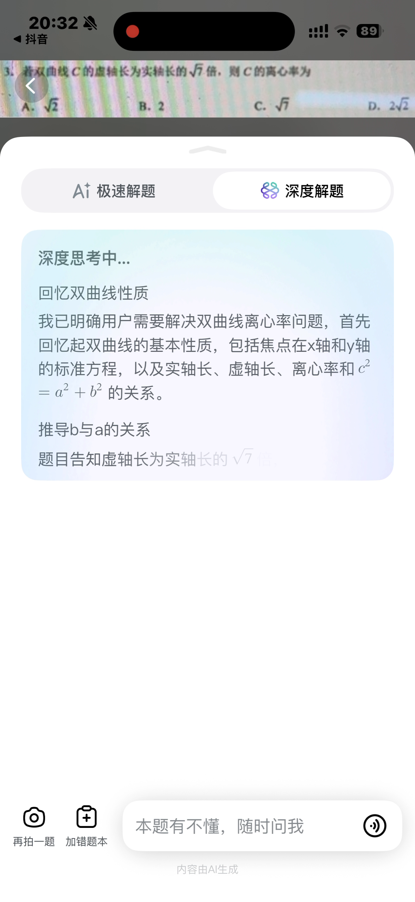
    </td>
    <td align="center" width="4%"><strong>→</strong></td>
    <td align="center" width="23%">
      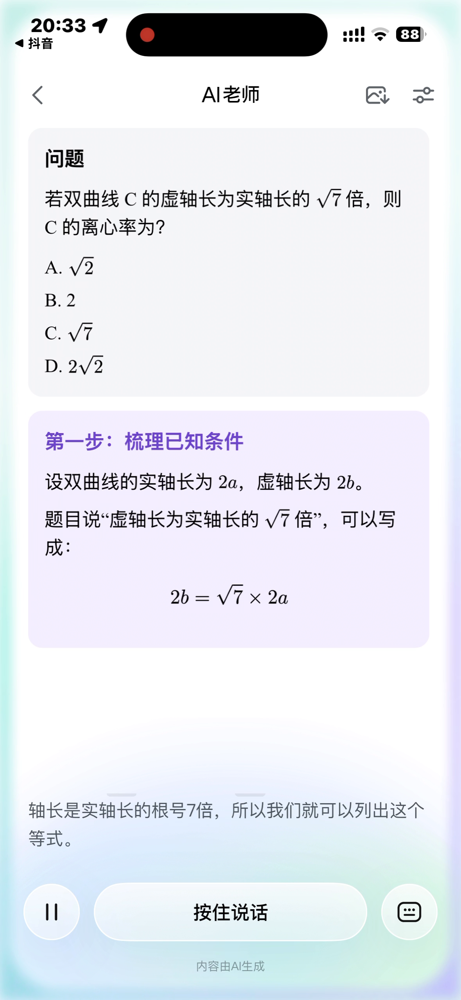
    </td>
    <td align="center" width="4%"><strong>→</strong></td>
    <td align="center" width="23%">
      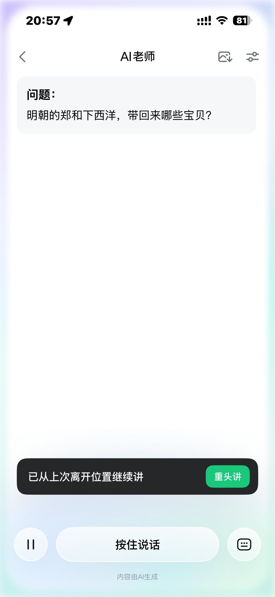
    </td>
  </tr>
  <tr>
    <td align="center">图 3-9 首页入口：先把拍题答疑和作业批改前置</td>
    <td></td>
    <td align="center">图 3-10 讲题前状态：系统先进入“深度思考中”</td>
    <td></td>
    <td align="center">图 3-11 分步讲题：正式进入结构化讲解页</td>
    <td></td>
    <td align="center">图 3-12 会话延续：支持从上次离开位置继续讲</td>
  </tr>
</table>

路径 B 对应“复盘与治理边界”，展示学习记录、答案认证与错题本资产层的分叉设计。

<table>
  <tr>
    <td align="center" width="23%">
      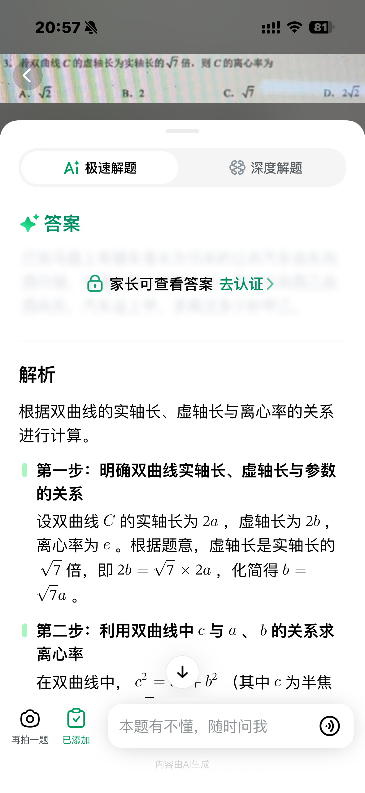
    </td>
    <td align="center" width="4%"><strong>→</strong></td>
    <td align="center" width="23%">
      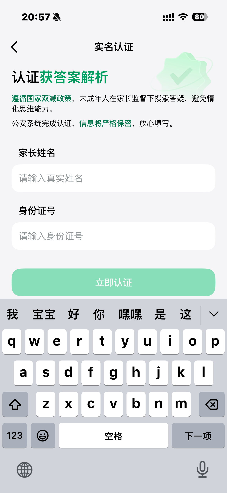
    </td>
    <td align="center" width="4%"><strong>∥</strong></td>
    <td align="center" width="23%">
      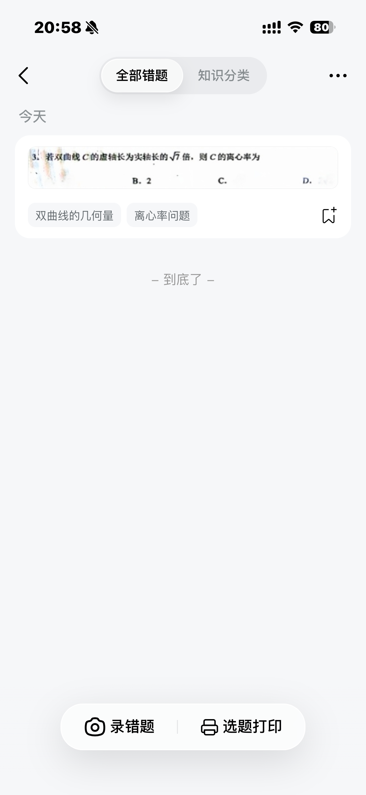
    </td>
    <td align="center" width="4%"><strong>→</strong></td>
    <td align="center" width="23%">
      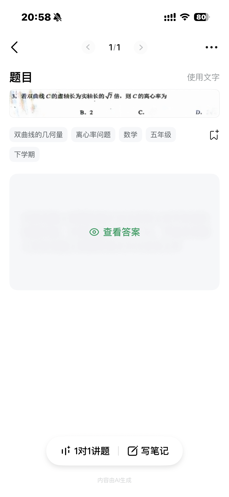
    </td>
  </tr>
  <tr>
    <td align="center">图 3-13 学习记录：答案查看先出现家长认证提示</td>
    <td></td>
    <td align="center">图 3-14 实名认证：治理约束落在家长身份校验</td>
    <td></td>
    <td align="center">图 3-15 错题列表：知识分类与选题打印继续开放</td>
    <td></td>
    <td align="center">图 3-16 错题详情：1 对 1 讲题与写笔记构成复盘动作</td>
  </tr>
</table>

#### `AI讲题` 作为首次价值时刻

综合体验记录与公开证据，`AI讲题` 可界定为豆包爱学的核心价值时刻，主要依据有三点：

- 体验笔记里，用户连续提到 `分步骤讲`、`可以随时打断`、`不懂还能继续解释`。[1](../04-experience/EXPERIENCE_REPORT.md)
- 应用商店 正向评论里，高频出现的是 `讲解清晰`、`像老师`、`不仅有答案，还有解析和互动`。[2](../03-platforms/appstore/summary.md)
- 小红书上，口语与讲题相关内容获得较高点赞和收藏，说明“AI 带着练”已具备传播属性。[3](../03-platforms/xiaohongshu/summary.md)

因此，产品分析的核心判断不应停留在“功能丰富”，而应聚焦于“题目解释被做成连续交互，而非静态答案输出”。

### 3.3 复盘资产与主要摩擦

#### `AI错题本` 作为复盘资产层

基于小红书样本与体验记录，错题本至少承担 `收集`、`分类`、`继续讲题`、`再练习` 四个动作，功能角色已超出“历史记录”范畴。

| 观察点 | 证据 | 结论 |
|---|---|---|
| 错题本被主动分享 | 小红书有高赞错题本内容与打印教程 | 用户已经把它当成可分享的功能点 |
| 错题本可继续讲题 | 单题详情页直接出现 `1对1讲题` | 复盘由静态回看转为再次互动 |
| 错题本可打印、写笔记 | 体验笔记明确提到 `选题打印`、`写笔记` | 它在把解题结果转成后续练习材料 |
| 学习记录反而受限 | 查看答案要家长认证 | 产品主动把“复盘资产”与“直接答案”分开 |

#### 主要摩擦点

| 短板 | 数据 / 证据 | 影响 |
|---|---|---|
| 正确率与稳定性 | 应用商店 评论中 `accuracy-concern` 命中 178 条；小红书出现明显负面帖 | 老师感越强，出错带来的反噬越大 |
| 图形题与图像能力 | 应用商店 评论多次提到图像、画图、几何题问题 | 复杂题型的信任仍不稳 |
| 学段深度 | 高学段、复杂题型抱怨更集中 | 当前更适合小学高年级到初中核心场景 |
| 入口发现性 | 豆包主 App 内入口更接近个性化前置，而非稳定一级入口 | 对新用户的自然发现不够稳定 |

---

## 4. 用户分析

本节主证据：[1](../03-platforms/appstore/summary.md) [2](../03-platforms/xiaohongshu/summary.md) [3](../04-experience/EXPERIENCE_REPORT.md)

本章聚焦核心用户、关键决策角色以及留存与流失原因。

### 4.1 核心用户与关键决策人

#### 用户样本说明

| 证据源 | 有效样本 | 这批样本适合回答什么 |
|---|---|---|
| 应用商店 | `979` 条评论 | 使用后满意度、差评原因、情绪性反馈 |
| 小红书 | `260` 条帖子 | 为什么传播、为什么推荐、为什么质疑 |
| 体验笔记 | `2` 轮人工体验 | 功能路径、关键价值时刻、反直觉设计 |

#### 核心用户画像

| 用户画像 | 典型证据 | JTBD | 为什么会留下 |
|---|---|---|---|
| 立即解题的学生 | 应用商店 中“难题也能轻松搞定”“讲解思路很清晰” | 在卡题场景下尽快获得可理解的分步讲解 | 讲题能力强、进入成本低 |
| 省事型家长 | 小红书 `parent` 主题 23 条、应用商店 家长视角评论 59 条 | 以更低陪伴成本完成作业辅导 | 免费、减负、能把题讲下去 |
| 复盘提分用户 | 小红书错题本、打印、查缺补漏内容 | 将错题沉淀为可持续使用的复习材料 | 错题本承担持续复盘功能，而非一次性收纳 |

  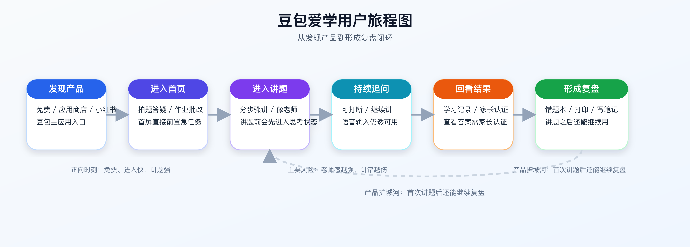

#### 用户角色与界面对应图板

<table>
  <tr>
    <td align="center" width="33%">
      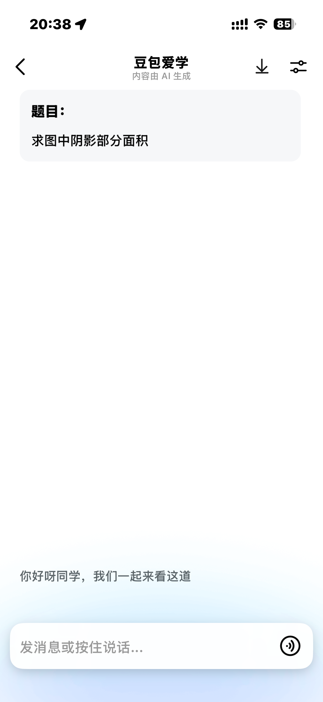
    </td>
    <td align="center" width="33%">
      
    </td>
    <td align="center" width="33%">
      
    </td>
  </tr>
  <tr>
    <td align="center">图 4-1 立即解题的学生：核心诉求是把题讲清楚，而不是只拿到答案</td>
    <td align="center">图 4-2 省事型家长：答案与认证设计把家长拉进关键决策环节</td>
    <td align="center">图 4-3 复盘提分用户：留下来的关键不是保存错题，而是继续讲、写笔记和再利用</td>
  </tr>
</table>

这三类角色并不完全分离。更常见的情况是：学生先以“把题做出来”为目标进入，家长在关键风险边界处被拉进决策链，真正留下来的用户再把错题页当成后续复盘入口。

### 4.2 用户旅程与关键转折

| 阶段 | 用户目标 | 正向体验 | 断裂风险 |
|---|---|---|---|
| 发现产品 | 找到能够解决学习问题的工具 | 免费、短内容传播、应用商店 高分 | 品牌混淆，豆包与豆包爱学边界不清 |
| 进入首页 | 尽快开始处理当前问题 | 首屏直接给拍题答疑、作业批改 | 主 App 入口稳定性不足 |
| 进入讲题 | 获得可理解的分步讲解，而非仅获得答案 | 分步骤讲、可追问、继续讲 | 一旦讲错，老师感会反噬 |
| 回看结果 | 确认题目、过程与答案是否可回溯 | 学习记录、继续讲、错题本 | 查看答案存在家长认证门槛 |
| 形成复盘 | 将本次解题转成后续可复用材料 | 错题本、分类、打印、写笔记 | 深层页体验不足会削弱长期留存 |

### 4.3 留存与流失原因

#### 留存因素

| 高分原因 | 证据 | 对产品意味着什么 |
|---|---|---|
| 免费 | 应用商店 有 27 条直接提到免费；小红书反复用“免费”做传播点 | 免费是最强的进入理由之一 |
| 讲解像老师 | 用户反复提到“讲解清晰”“不仅有答案，还有解析和互动” | 老师感是豆包爱学的核心用户价值 |
| 家长减负 | 小红书家长向内容集中在“减负”和“不费妈” | 家长并非次要人群，而是重要传播者 |
| 错题可复盘 | 错题本、打印、继续讲题形成第二条主线 | 长期留存机会在复盘而非首次问答 |

#### 主要流失风险

免费并未显著降低用户对正确率的要求。相反，“像老师”的产品预期提高了容错门槛；一旦讲解出错，失望感和负面传播都会被放大。

---

## 5. 外部认知与社媒分析

本节主证据：[1](../03-platforms/xiaohongshu/summary.md) [2](../03-platforms/appstore/summary.md) [3](../03-platforms/bilibili/summary.md) [4](../03-platforms/weibo/summary.md) [5](../03-platforms/zhihu/summary.md)

外部讨论高度集中于 `小红书 + 应用商店`。B 站以教程和零散展示为主；微博、知乎尚未形成针对豆包爱学的稳定讨论。

  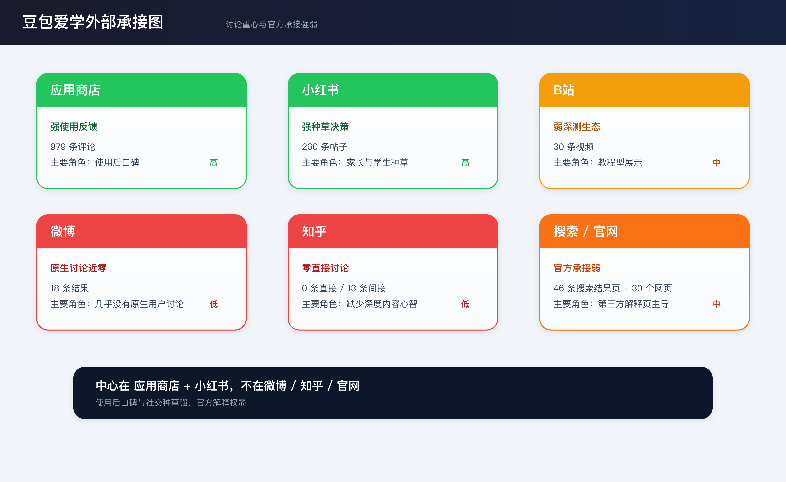

### 5.1 平台角色分工

| 平台 | 当前样本 | 平台最能说明什么 | 判断 |
|---|---|---|---|
| 小红书 | `260` 条帖子 | 传播爆点、用户心智、家长与学生为什么分享 | 是主要的轻决策平台 |
| 应用商店 | `979` 条评论 | 真正使用后的满意度和差评原因 | 是主要的使用后口碑平台 |
| B 站 | `30` 条相关视频 | 教程和少量展示 | 有内容，但还没形成深测生态 |
| 微博 | 近乎空白 | 事件型品牌声量 | 豆包主品牌更强，爱学弱 |
| 知乎 | 基本空白 | 专业解释与深度长评 | 没有进入深内容心智 |

### 5.2 正负向主题

#### 正向主题

| 主题 | 主要平台 | 代表信号 | 结论 |
|---|---|---|---|
| 免费 | 小红书 + 应用商店 | `免费练口语`、`不用会员`、`完全免费` | 免费是扩散和评分的共同锚点 |
| 讲题像老师 | 应用商店 + 体验 | `讲解很清晰`、`互动式解析` | 讲题能力已成为核心价值认知 |
| 家长减负 | 小红书 | `不费妈`、`辅导作业省心` | 家长场景是强传播入口 |
| 错题复盘 | 小红书 + 体验 | `查缺补漏`、`打印错题`、`继续讲题` | 错题本强化了长期学习工具属性 |

#### 负向主题

| 主题 | 主要平台 | 代表信号 | 风险 |
|---|---|---|---|
| 正确率不稳 | 小红书 + 应用商店 | `只有80%`、`一会儿答案a一会儿答案b` | 这是最核心的口碑断裂点 |
| 图像 / 几何能力 | 应用商店 | 图形题、画图、OCR 问题 | 复杂题型信任不足 |
| 功能稳定性 | 小红书官方评论区 | `讲题功能时有时无` | 核心价值模块一旦不稳，伤害更大 |
| 品牌混淆 | 小红书 | 豆包、豆包老师、豆包爱学混在一起 | 会稀释独立品牌心智 |

### 5.3 品牌认知与传播风险

| 功能点 | 主要证据 | 当前认知位置 |
|---|---|---|
| 口语练习 | 小红书 `oral` 主题 `24` 条 | 已成显性传播卖点 |
| 作业辅导 | 小红书 `homework` 主题 `24` 条 | 是家长内容的高频切入口 |
| 错题本 | 小红书 `cuoti` 主题 `17` 条 | 已经被认知为提分工具，不只是收纳页 |
| 拍照答疑 | 首页入口 + 小红书功能帖 | 是进入产品的起点，但不足以概括全部产品价值 |

#### 本章结论

1. 豆包爱学的社媒传播以 `轻决策传播` 为主，尚未形成深教研传播。
2. 用户在小红书被 `免费、老师感、家长减负、错题复盘` 打动；在 应用商店 则更容易把真实满意和真实失望说出来。
3. 主要外部风险不在讨论量不足，而在品牌边界模糊，以及高“老师感”预期对错误的放大效应。

---

## 6. 搜索承接与内容分析

本节主证据：[1](../03-platforms/web/summary.md) [2](../03-platforms/seo/summary.md)

### 6.1 品牌词与问题词的官方承接现状

SEO 与 Web 证据显示，官方承接面存在三项明确现象：

- `doubao.com/student` 返回 404，属于页面下线而非渲染异常
- `doubao.com/chat/` 和 `doubao.com/about` 都是豆包通用能力页面，没有爱学专属承接
- 旧域名 `hippolearning.cn` 仍被索引，但服务的是旧品牌和 B 端叙事

  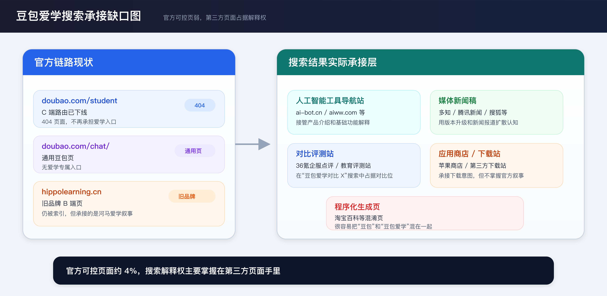

搜索链路已经很清楚：`C 端入口已撤`、`通用豆包页不承接爱学`、`旧品牌 B 端页仍在被索引`。因此，品牌词与问题词下的解释权自然外流到第三方页面。

### 6.2 搜索结果页与落地页承接格局

46 个去重搜索结果页里，官方可控页面只占约 4%。承接搜索的主要是五类页面：

- AI 工具导航站
- 媒体新闻稿
- 对比评测站
- 应用商店 / 下载站
- 程序化生成页

这不是单点内容缺失，而是公开承接面本来就没有被官方认真经营。至少在搜索引擎这一层，豆包爱学并不靠官方页面获客。

### 6.3 内容资产与机会空位

从公开证据看，豆包爱学当前呈现出明显的 `生态分发型产品` 特征：

- 获客靠豆包主 App、应用商店和短内容传播
- 品牌解释靠第三方页面代为完成
- 自己几乎不经营 FAQ、专题页、博客或功能落地页

这给出了一个很实际的机会：`高意图搜索词` 还没有被官方页面牢牢占住。像“豆包爱学怎么样”“豆包爱学好用吗”“豆包爱学和作业帮哪个好”，现在仍有被高质量评测页和对比页截流的空间。

---

## 7. 商业化与治理边界

本节主证据：[1](../03-platforms/pricing/summary.md) [2](../04-experience/EXPERIENCE_REPORT.md) [3](../03-platforms/appstore/summary.md)

### 7.1 用户可见付费结构

本轮体验记录未观察到 `会员`、`订阅`、`价格页`、`高级功能解锁` 等典型收费触发。`应用商店` 页面同样以 `免费` 为主叙事，未突出内购信息。

在用户可见层，豆包爱学更接近以扩大用户规模为目标的免费学习工具，尚未表现出明显的订阅转化取向。

### 7.2 付费触发点与弱付费线索

第三方评测材料曾出现 `学力提升计划` 和 `进阶版解题思路` 等表述，但本轮体验未能验证。基于现有证据，更稳妥的表述为：

- 不能写成“豆包爱学已经形成会员体系”
- 只能写成“历史上出现过弱付费预埋线索，但本轮实测未验证”

如果将“弱线索”直接写成“已成立事实”，商业化阶段判断会明显失真。

### 7.3 认证、合规与风险控制边界

第二轮体验显示，`学习记录 / 查看答案需家长认证` 是比收费更关键的边界设计。该门槛的功能更接近治理措施，而非付费筛选：

- 过程和解析可以继续看
- 直接答案需要家长参与

这一设计更接近教育场景中的 `合规护栏`，而非 `付费墙`。同时，`AI错题本` 仍保持开放，并提供 `打印`、`1对1讲题`、`写笔记` 等动作，说明产品当前更重视学习行为管理，而非即时收费。

### 7.4 当前阶段判断

综合上述证据，豆包爱学当前所处阶段更接近：

| 观察信号 | 含义 |
|---|---|
| 核心能力普遍免费 | 先做渗透率和使用频次 |
| 入口依赖豆包生态与 应用商店 | 先把用户带进来 |
| 错题本与学习记录被持续强化 | 先把学习资产沉淀下来 |
| 家长认证出现在答案查看环节 | 优先做风险控制和正当性包装 |

若未来进入收费阶段，更可能围绕“更深讲解、更系统练习和更自动化复盘”收费，而非单纯按提问次数收费。现有证据尚不足以证明这一转变已经发生。

---

## 8. 竞争判断

本节主证据：[1](../03-platforms/appstore/summary.md) [2](../03-platforms/xiaohongshu/summary.md) [3](../03-platforms/seo/summary.md) [4](../04-experience/EXPERIENCE_REPORT.md)

本章在前文证据基础上，对已建立优势、未站稳层级及可切入窗口做综合判断。

### 8.1 它已经赢下什么

豆包爱学正在将 `免费 AI 讲题` 塑造成目标用户群的基线预期。对于普通学生和年轻家长，竞争已不再停留在“能否拍题”，而是转向“能否像老师一样把题讲清楚，而且不额外收费”。

在这一基线下，仅提供答案、单段文本解释、无追问和无复盘的产品形态会明显失去竞争力。

### 8.2 它还没站稳什么

但上述优势并不等于所有层级都已稳定。当前至少有四个尚未站稳的点：

| 没站稳的层 | 当前表现 | 含义 |
|---|---|---|
| 正确率信任 | 18.2% 评论提到不准 | 一旦错，老师感会反噬 |
| 深学段能力 | 高中和复杂图形题口碑偏弱 | 尚未形成全学段稳态能力 |
| 独立品牌承接 | 微博、知乎弱，SEO 弱，Web 入口撤回 | 品牌仍依附豆包生态 |
| 公开收费结构 | 本轮实测未见会员体系 | 还在用户规模阶段，不在收割阶段 |

### 8.3 护城河、脆弱点与可切入窗口

  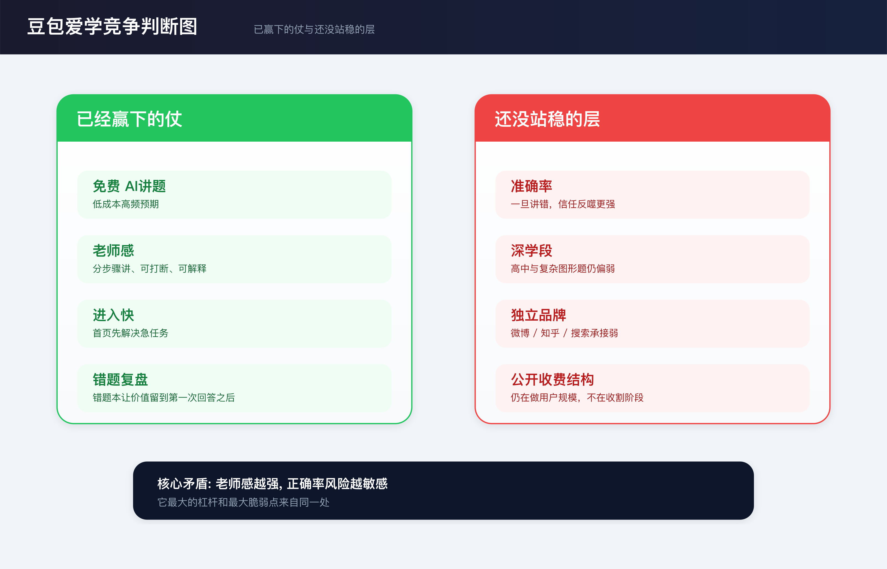

对我方而言，最直接的竞争压力不在功能数量，而在于豆包爱学已将 `老师感` 做成低门槛、免费且可重复使用的体验。这一变化抬高了用户预期：

- 用户不再满足于静态答案
- 用户开始期待能打断、能追问、能继续讲
- 用户会默认错题应该被保存、分类、再利用

#### 当前窗口

当前可识别的切入窗口主要有四个：

1. `正确率与透明度` 仍然存在空位。只要讲解出错，前期建立的信任就会迅速流失。  
2. `搜索与内容承接` 仍然存在空位。官方几乎没有系统经营自己的搜索解释权。  
3. `家长协同设计` 仍然存在空位。当前设计停留在家长认证式门槛，尚未扩展为完整协同机制。  
4. `深教研和系统化学习` 仍然存在空位。知乎上的 AI 教育心智依旧由学习机和体系化产品占据。  

---

## 9. 对我方建议

### 9.1 跟 / 避 / 绕 / 观察

| 类型 | 建议 | 理由 |
|---|---|---|
| 跟 | 跟进 `拍题/作业 -> 分步讲题 -> 追问 -> 继续讲` 的老师时刻闭环，以及 `错题 -> 继续讲 / 写笔记 / 导出练习` 的复盘资产层 | 这是豆包爱学已经验证过的高感知价值，否则难以满足已被抬高的用户预期 |
| 避 | 避免把产品继续做成“更会答题的工具”，也避免用文案掩盖正确率问题 | 用户已将“像老师”视为基线，一旦讲错，信任损失会明显高于普通问答工具 |
| 绕 | 绕开“免费拍题”正面价格战，优先做 `正确率透明度 + 家长协同 + 更系统的复盘结果` | 这是豆包爱学当前尚未完全站稳的层，也是我方更容易建立差异的位置 |
| 观察 | 继续观察 `学力提升计划/会员` 是否坐实、家长认证是否升级成完整协同、搜索承接是否补齐 | 这三项决定它会不会从“免费工具”进入“系统化学习平台”阶段 |

### 9.2 P0 / P1 / P2 动作表

| 优先级 | 动作 | 为什么现在做 | 负责人 | 30-45 天产出 |
|---|---|---|---|---|
| P0 | 做一条 `拍题 -> 分步讲题 -> 追问 -> 继续讲` 的可演示闭环 | 先补齐用户对“老师感”的新基线 | AI Agent + 开发 Agent | 一条可稳定跑通的 Demo 闭环 + 10 道样题评测结果 |
| P0 | 把错题中心做成复盘资产，而不只是历史记录 | 豆包爱学的第二优势在复盘，不补这一层会少一半价值 | 产品 Agent + 开发 Agent | 带 `标签 / 写笔记 / 继续讲 / 导出练习` 的原型与最小页面 |
| P0 | 上线高意图搜索词截流内容 | 豆包爱学在搜索解释权上仍有明显空位 | SEO Agent + 调研 Agent | 6 篇高意图评测/对比页 + 收录监控 |
| P1 | 研究“学生可见 / 家长可见”的权限分层，避免直接复制实名认证方案 | 家长认证说明这是高敏感边界，但当前方案尚未形成真正的家长协同 | 产品 Agent + 测试 Agent | 权限分层方案 + 5 位家长访谈纪要 |
| P1 | 把正确率问题做成显式工程，而不是文案工程 | 这是最可能削弱老师感的环节 | AI Agent + 开发 Agent | 题型评测集 + 置信提示 + 错误兜底策略 |
| P2 | 若未来考虑收费，优先卖“更系统的学习结果”，不要急着卖“提问次数” | 这比简单会员墙更接近用户愿意付费的价值 | 策略 Agent + 产品 Agent | 商业化假设文档 + 付费对象判断 |

### 9.3 30 天验证动作

1. 用 `10-20` 道高频题型验证老师时刻闭环是否稳定成立，重点看 `讲题完成率`、`追问继续率`、`主观理解度`。
2. 用 `1` 个最小错题中心原型验证用户是否会把“保存错题”升级为“继续复盘”。
3. 用 `6` 篇高意图评测/对比内容验证搜索词是否能带来稳定曝光和点击。

---

## 10. 证据附录与索引

### 10.1 本轮主证据

| 证据源 | 数量/状态 | 作用 |
|---|---|---|
| `应用商店` 评论 | 979 条 | 用户满意度、准确率风险、免费心智 |
| 小红书帖子 | 260 条 | 家长和学生的真实种草/避雷/对比 |
| 微博验证 | 18 条 | 验证“几乎无原生讨论” |
| B站视频 | 30 条 | 判断是否存在深度测评生态 |
| 知乎样本 | 13 条间接记录，0 条直接讨论 | 判断专业家长心智中的缺席 |
| SEO 搜索结果页 | 46 个去重页面 | 判断搜索承接格局 |
| Web 证据 | 30 条 | 判断官网、旧域名与入口状态 |
| 真实体验素材 | 两轮截图 + 录屏 + 抽帧 | 验证讲题、学习记录、错题本、免费与认证逻辑 |

### 10.2 本轮最关键的内部证据文件

- `../01-process/PROCESS_LOG.md`
- `../01-process/KEY_DECISIONS.md`
- `../03-platforms/appstore/summary.md`
- `../03-platforms/xiaohongshu/summary.md`
- `../03-platforms/weibo/summary.md`
- `../03-platforms/bilibili/summary.md`
- `../03-platforms/zhihu/summary.md`
- `../03-platforms/seo/summary.md`
- `../03-platforms/web/summary.md`
- `../03-platforms/pricing/summary.md`
- `../04-experience/notes/SESSION_001_FINDINGS.md`
- `../04-experience/notes/SESSION_002_FINDINGS.md`

### 10.3 当前仍保留的边界

- 还没有把 `选题打印`、`1对1讲题`、`写笔记` 的后续展开页补到完整
- 还没有做题型级准确率实测，所以“正确率风险”仍以用户反馈为主
- 还没有拿到 Android 与学习机渠道数据，这份报告仍以 iOS 和公开 Web 证据为主
